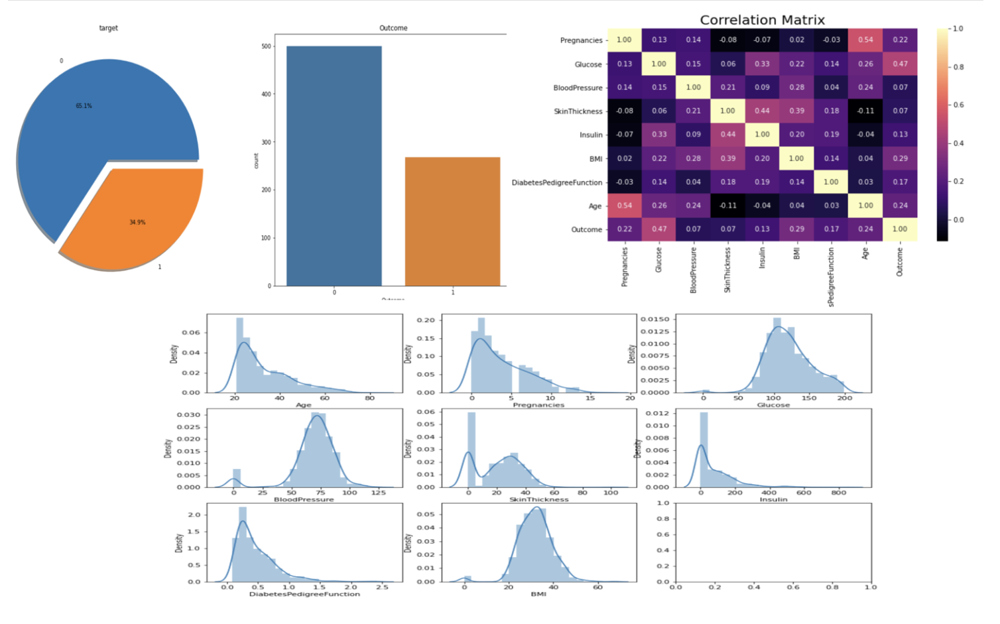
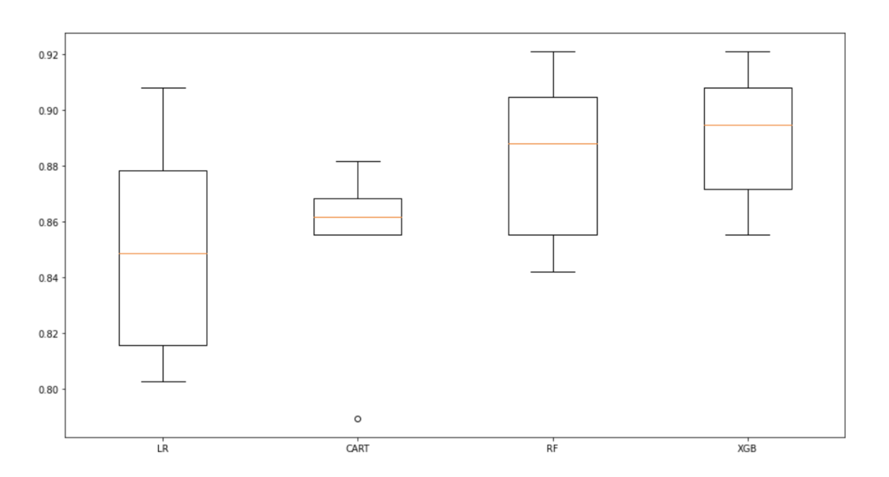
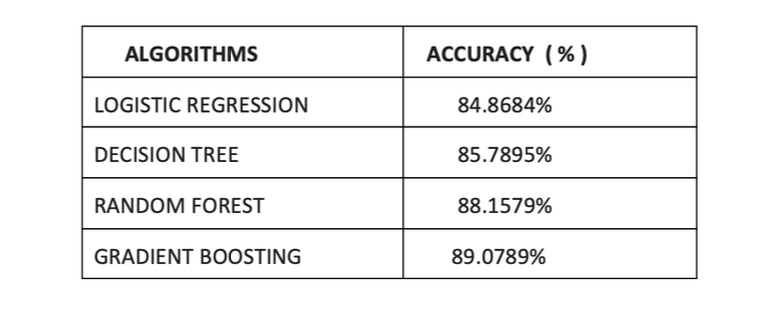
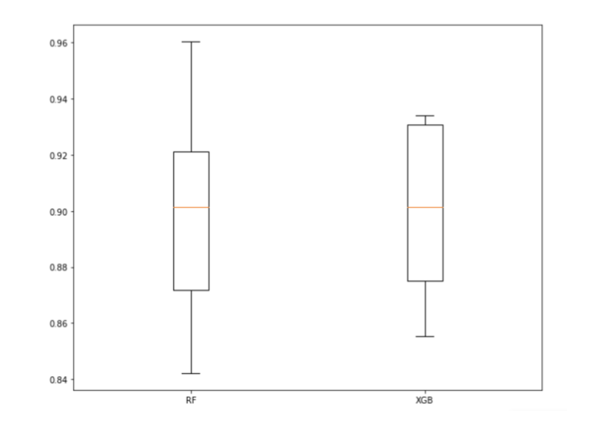
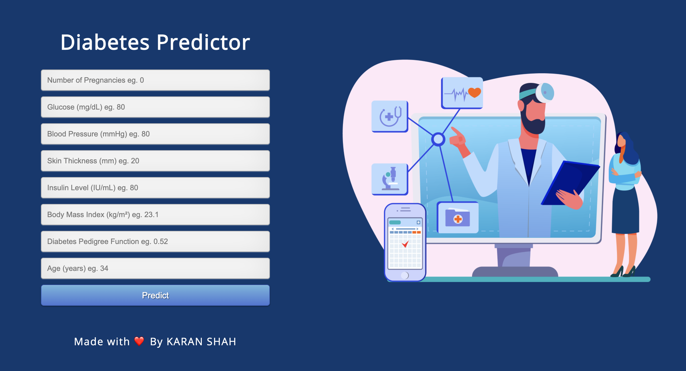

# Diabetes Predictor

## Table of Content

 1. Overview
 2. Details about the dataset
 3. Motivation
 4. Learning-Objective
 5. Technical-aspect
 6. Technologies-used
 7. installation
 8. Exploratory Data Analysis
 9. Data Pre-processing
 10. Description Of Algorithm Used
 11. Comparision Of Algorithms And Result

### Overview
We are trying to build a machine learning model to accurately predict whether the patients have diabetes or not.our objective is to prevent, cure and to improve the lives of all people affected by diabetes.

### Details about the dataset
The datasets consists of several medical predictor variables and one target variable, Outcome. Predictor vari- ables includes the number of pregnancies the patient has had, their BMI, insulin level, age, and so on.

- Pregnancies: Number of times pregnant
- Glucose: Plasma glucose concentration a 2 hours in an oral glucose tolerance test 
- BloodPressure: Diastolic blood pressure (mm Hg)
- SkinThickness: Triceps skin fold thickness (mm)
- Insulin: 2-Hour serum insulin (mu U/ml)
- BMI: Body mass index (weight in kg/(height in m)2)
- DiabetesPedigreeFunction:Diabetespedigreefunction
- Age:Age(years)
- Outcome:Classvariable(0 or 1)

### Motivation
The motivation was to experiment  with end to end machine learning project and get some idea about deployment platform like and offcourse this
" Diabetes is an increasingly growing health issue due to our inactive lifestyle. If it is detected in time then through proper medical treatment, adverse effects can be prevented. To help in early detection, technology can be used very reliably and efficiently. Using machine learning we have built a predictive model that can predict whether the patient is diabetes positive or not.".
This is also sort of fun to work on a project like this which could be beneficial for the society. 

### Learning Objective
The following points were the objective of the project . If you are looking for all the following points in this repo then i have not covered all in this repo. I'm working on blog about this mini project and I'll update the link of blog about all the points in details later . (The main intention was to create an end-to-end ML project.)  
- Data gathering 
- Descriptive Analysis 
- Data Visualizations 
- Data Preprocessing 
- Data Modelling 
- Model Evaluation 
- Model Deployment 

### Technical Aspect 

- Training a machine learning model using scikit-learn. 
- Building and deploying a Flask web app 
- A user has to put details like Number of Pregnancies, Insulin Level, Age, BMI etc . 
- Once it get all the fields information , the prediction is displayed on a new page . 
### Technologies Used  
 

[

]

### Installation 
- Clone this repository and unzip it.
- After downloading, cd into the flask directory.
- Begin a new virtual environment with Python 3 and activate it.
- Install the required packages using pip install -r requirements.txt
- Execute the command: python app.py

### Exploratory Data analysis
The data set’s structural data were checked. The types of variables in the dataset were examined. Size information of the dataset was accessed. The 0 values in the data set are missing values. Primarily these 0 values were replaced with NaN values. Descriptive statistics of the data set were examined and The distribution of the outcome variable were visualized.

### Data Pre-processing
The NaN values missing observations were filled with the median values of each variable was sick or not.The outliers were determined by LOF and dropped. The X variables were standardized with the rubost method.

### Description of algorithm Used

#### Logistic Regression 
It is  a classification method based on Linear Regression. Logistic Regression should be used for classification not for regression. The target variable can be a binary class or multi-class. In this project, we will apply some data exploration techniques to understand and explore the datasets. We will then apply the Logistic Regression classification algorithm.

#### Decision Tree 
It is is a supervised machine learning algorithm used to solve classification problems. The main objective of using Decision Tree in this research work is the prediction of target class using decision rule taken from prior data. It uses nodes and internodes for the prediction and classification. Root nodes classify the instances with different features. Root nodes can have two or more branches while the leaf nodes represent classification.

#### Random Forest 
It is a supervised learning, used for both classification and Regression. The logic behind the random forest is bagging technique to create random sample features. The difference between the decision tree and the random forest is the process of finding the root node and splitting the feature node will run randomly.

#### Gradient Boosting Algorithm or GBM 
It combines the predictions from multiple decision trees to gener- ate the final predictions.the nodes in every decision tree take a different subset of features for selecting the best split. This means that the individual trees aren’t all the same and hence they are able to capture different signals from the data.Additionally, each new tree takes into account the errors or mistakes made by the previous trees. So, every successive decision tree is built on the errors of the previous trees. This is how the trees in a gradient boosting machine algorithm are built sequentially.

### Comparision of algorithms and result 

During Model Building: Logistic Regression,CART, Random Forests, XGBoost, using machine learning models Cross Validation Score and accuracy were calculated.

Later Random Forests, XGBoost hyperparameter optimizations optimized to increase Cross Valida- tion value.

#### Result:- The model created as a result of XGBoost hyperparameter optimization became the model with the lowest Cross Validation Score value(0.90)

### Model Deployment
we created a web app using Flask which is a python micro framework,so now people can fill the form and predict wheather they have diabetes or not.

###  Made with &nbsp;❤️ by  [Karan Shah](https://github.com/karan19100) , [Jil Patel](https://www.linkedin.com/in/jil-patel-4936a11b2) , [Akshat Shah](https://www.linkedin.com/in/akshat-shah-225171203)

